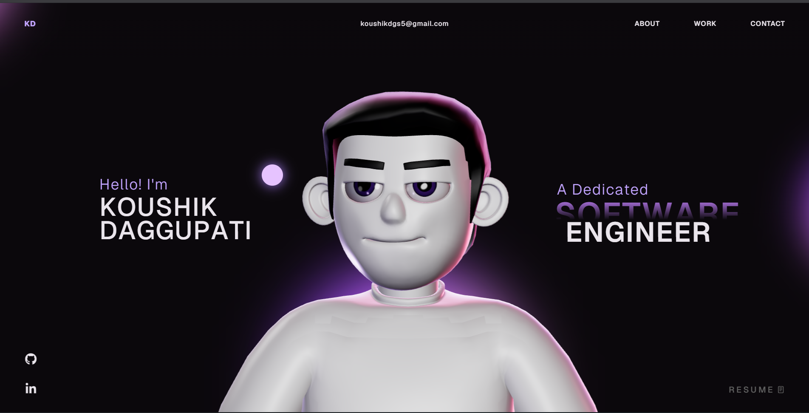
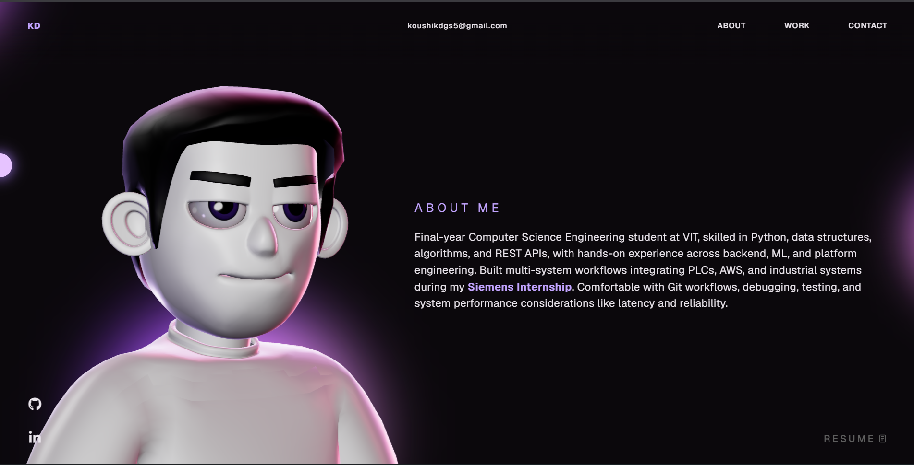

# Koushik Daggupati - Portfolio 🚀

A modern, animated personal portfolio website showcasing my profile, skills, projects, education, certifications, and experience.

## 🌐 Live Portfolio

[Visit My Portfolio](https://portfolio-virid-nine-76.vercel.app)

---

## 👨‍💻 About Me

Hi, I'm **Koushik Daggupati**, a Software Engineer with interests across:

- Software Development
- Data Science
- Artificial Intelligence
- Machine Learning
- Cloud Computing
- Data Analytics

I enjoy building practical software solutions, working with modern technologies, and exploring intelligent systems, automation, and data-driven applications.

---

## 🛠️ Tech Stack

### Programming & Development

- Python
- Java
- C
- C++
- JavaScript
- TypeScript
- HTML
- CSS
- SQL

### Frontend & Visualization

- React
- Vite
- Three.js
- WebGL
- GSAP

### AI / ML / Data

- Machine Learning
- Deep Learning
- CNN
- Neural Networks
- Activation Functions
- RAG
- LLM
- Node.js
- AI Agents

### Data & Analytics Tools

- Power BI
- Data Analytics
- Grafana

### Automation & Other Tools

- Power Automate
- n8n
- Node-RED
- Git
- GitHub
- Vercel

---

## ✨ Portfolio Features

- Interactive 3D animated character
- GSAP-powered animations
- Smooth scrolling experience
- Responsive modern UI
- Projects showcase
- Skills and tools section
- Education details
- Certifications
- Contact section
- Social media links
- Animated loading screen
- Production deployment using Vercel

---

## 📸 Portfolio Preview





---

## 📂 Project Structure

```text
portfolio
│
├── public
│   ├── images
│   ├── models
│   └── draco
│
├── src
│   ├── components
│   ├── styles
│   └── utils
│
├── index.html
├── package.json
├── vite.config.ts
└── README.md
